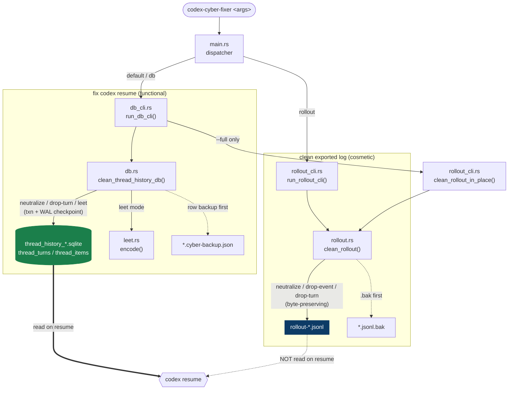

# codex-cyber-fixer

Clear hard-block policy refusals — **cybersecurity Trusted Access** and
**misalignment policy violation** — from a Codex session so `codex resume`
keeps working instead of getting stuck on:

```
This content can't be shown
  We take extra caution with cybersecurity requests. If you’re a security professional, you may be able to apply for Trusted Access.
  Trusted Access: https://openai.com/form/enterprise-trusted-access-for-cyber/
  Learn more: https://help.openai.com/en/articles/20001326
```

A small single-binary CLI in **[Rust](https://www.rust-lang.org)** (~1.3 MB). It
only edits local Codex state — nothing is sent anywhere.

> **Scope.** This is a cleanup utility for *false-positive over-refusals* on
> authorized work (security research, alignment research, red-teaming). It
> removes a refusal marker already stored on your own disk. It does **not**
> bypass the live server-side moderation (a risky prompt is re-flagged from
> scratch on every send), cannot recover content the backend refused (that
> turn was generated with no model output), and does not help you attack or
> scan systems you aren't authorized to test. It makes a *stuck resume* usable
> again — that's the whole job.

## The one thing to understand

On current Codex builds, **`codex resume` is rebuilt from a SQLite thread-history
database, not from the rollout `.jsonl` log.**

| Store | Path | Role | Cleaner |
|-------|------|------|---------|
| **thread-history DB** | `…/thread_history_*.sqlite` | **source of truth** for resume | `db` (default) ✅ |
| rollout log | `…/sessions/…/rollout-*.jsonl` | exported transcript; **not** read on resume | `rollout` (cosmetic) |

So editing the `.jsonl` does **not** unblock a session (and it desyncs byte
offsets the DB records). You must fix the **DB** — the default `db` subcommand.

In the DB, a hard-blocked turn is a `thread_turns` row with `status='failed'`
and an `error_json` whose `codexErrorInfo` is `cyberPolicy` **or**
`misalignmentPolicyViolation` — both stop resume the same way and are cleared
the same way. (The "This content can't be shown" text is never stored — it's
just how the TUI renders that row.) Three ways to fix it:

| `--mode` | Effect on the blocked turn | Keeps user msg? |
|----------|----------------------------|:---------------:|
| `neutralize` *(default)* | `status → interrupted`, `error_json → NULL` | ✅ (original text) |
| `drop-turn` | delete the turn row **and** its `thread_items` | ❌ |
| `leet` | neutralize **+** rewrite user message text into leet speak | ✅ (obfuscated) |

Neutralize/leet flip the failed turn to `interrupted` — a legitimate `TurnStatus`
meaning "the user aborted this turn" — rather than `completed`, which would
falsely claim the model produced output.

`neutralize` is enough to unblock. Use `drop-turn` to also make the turn vanish
from the timeline. Use `leet` to unblock **and** obfuscate the user message so a
re-scan no longer matches the cyber signature.

## Architecture

One binary, one dispatcher, two independent cleaners over two separate stores.
`--full` is the only place they meet: after the DB fix it also runs the rollout
cleaner on the matching `.jsonl`. Each cleaner writes a **backup first**.



## Install

Prebuilt binaries are on the [Releases](../../releases) page:
`codex-cyber-fixer-{windows-x64.exe, linux-x64, linux-arm64, darwin-x64, darwin-arm64}`.

From source (needs a [Rust](https://www.rust-lang.org/tools/install) toolchain
≥ 1.74 and a C compiler for the bundled SQLite):

```bash
cargo build --release        # → target/release/codex-cyber-fixer[.exe]
```

## Usage

`db` is the default subcommand — anything that isn't `rollout` is a `db` call.

```bash
codex-cyber-fixer <session-id> --dry-run   # preview (read-only, safe while Codex runs)
codex-cyber-fixer <session-id>             # apply: clear the block, keep your message
codex-cyber-fixer <session-id> --mode drop-turn   # remove the whole blocked turn
codex-cyber-fixer <session-id> --mode leet        # clear block + obfuscate user msg
codex-cyber-fixer --all                    # every blocked thread in the DB
codex-cyber-fixer <session-id> --full      # also tidy the matching rollout .jsonl
```

`<session-id>` is the thread id from `codex resume <id>`. A JSON backup of the
affected rows is written next to the DB before any change.

> **Exit Codex before applying changes** — it holds the DB open and caches the
> timeline, so a write while it runs may be lost. `--dry-run` is safe anytime.

### Where the DB lives — `sqlite_home`

By default the tool looks under the Codex home (`CODEX_HOME`, else `~/.codex` /
`%USERPROFILE%\.codex`). A session can relocate the whole SQLite state with
`codex -c 'sqlite_home = "D:\codex-state"'` — this is **not recorded anywhere the
tool can read**, so you must point it at the same place:

```bash
codex-cyber-fixer <session-id> --sqlite-home "D:\codex-state"
codex-cyber-fixer <session-id> --db "D:\codex-state\thread_history_1.sqlite"
```

Resolution order: `--db` → `--sqlite-home` → `CODEX_SQLITE_HOME` → `CODEX_HOME`
→ `~/.codex`.

### Options

```
db (default):
  -m, --mode <m>        neutralize | drop-turn | leet (default: neutralize)
  -s, --sqlite-home <d> directory holding thread_history_*.sqlite
      --db <file>       operate on this exact .sqlite file
      --all             target every thread, not just the given ids
      --full            after the DB fix, also clean the matching rollout .jsonl
                        (cosmetic; needs explicit id(s), ignored with --all)
  -n, --dry-run         list what would change; write nothing

rollout (cosmetic — exported logs only, does NOT affect resume):
  codex-cyber-fixer rollout <session-id | file | glob> [options]
  -m, --mode <m>        neutralize | drop-event | drop-turn | leet
      --no-backup       overwrite without a .bak
  -c, --copy            write *.cleaned.jsonl instead of overwriting
  -o, --out <path>      write result to <path>
  -n, --dry-run   -q, --quiet
```

## Leet speak obfuscation (`--mode leet`)

The `leet` mode goes a step beyond `neutralize`: it also rewrites the user
message text into **leet speak** (l33t), substituting letters with visually
similar numbers so a re-scan of the thread no longer matches the policy
signature (cyber or misalignment). Applied in both the DB (source of truth)
and the rollout `.jsonl` when using `--full`.

```
Original:  hello world, I am a hacker
Encoded:   h3110 w0r1d, 1 4m 4 h4ck3r
```

Substitution table (encode direction):

| Letter | Leet |
|--------|------|
| A | 4 |
| B | 8 |
| E | 3 |
| G | 6 |
| I | 1 |
| L | 1 |
| O | 0 |
| S | 5 |
| T | 7 |
| Z | 2 |

Encoding is deterministic (one canonical substitution per letter). Punctuation,
digits, whitespace, and non-ASCII characters are preserved verbatim. Only
`userMessage` content parts with `type: "text"` are rewritten; other item types
and metadata are untouched.

A **decoder** (`leet::decode`) is also included for the reverse direction — it
uses context-aware disambiguation with a common-word lexicon to pick the most
likely plain-text reading when a leet symbol is ambiguous (e.g. `1` → I, L, or
R depending on which candidate forms a real word).

## Layout

Rust, one binary. Deps: `rusqlite` (feature `bundled` — SQLite compiled in, no
system lib), `serde_json` (`preserve_order`), `walkdir`, `glob`.

```
src/
  main.rs          dispatcher: db (default) / rollout
  db.rs            SQLite thread-history cleaner (the fix for resume) + tests
  db_cli.rs        CLI for db.rs      → run_db_cli(argv)
  leet.rs          leet speak encoder/decoder + tests
  rollout.rs       rollout .jsonl cleaner (pure transform) + tests
  rollout_cli.rs   CLI for rollout.rs → run_rollout_cli(argv)
```

`clean_rollout()` is pure (re-serializes only changed lines, everything else
byte-for-byte). `clean_thread_history_db()` backs up the affected rows before a
single transaction, then `PRAGMA wal_checkpoint(TRUNCATE)` so the change survives
a discarded `-wal`. Tests are `#[cfg(test)]` modules in `rollout.rs` and `db.rs`.

```bash
cargo test
```

CI (`.github/workflows/release.yml`) builds each target on its native runner
(the bundled SQLite needs a per-OS C toolchain) and attaches the five binaries to
the GitHub Release on a `v*` tag.
